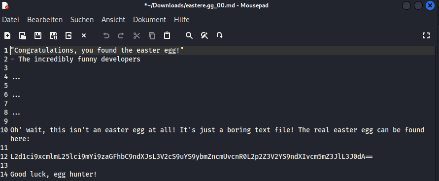
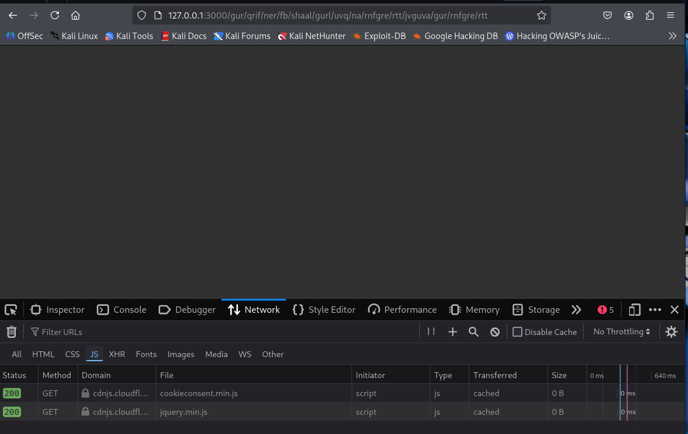
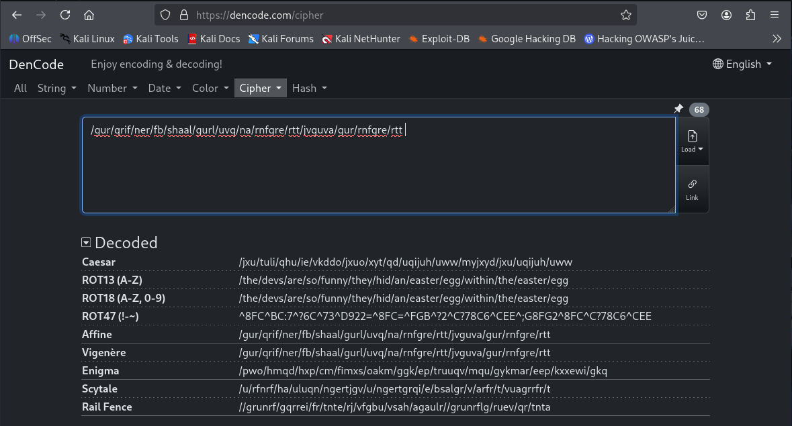
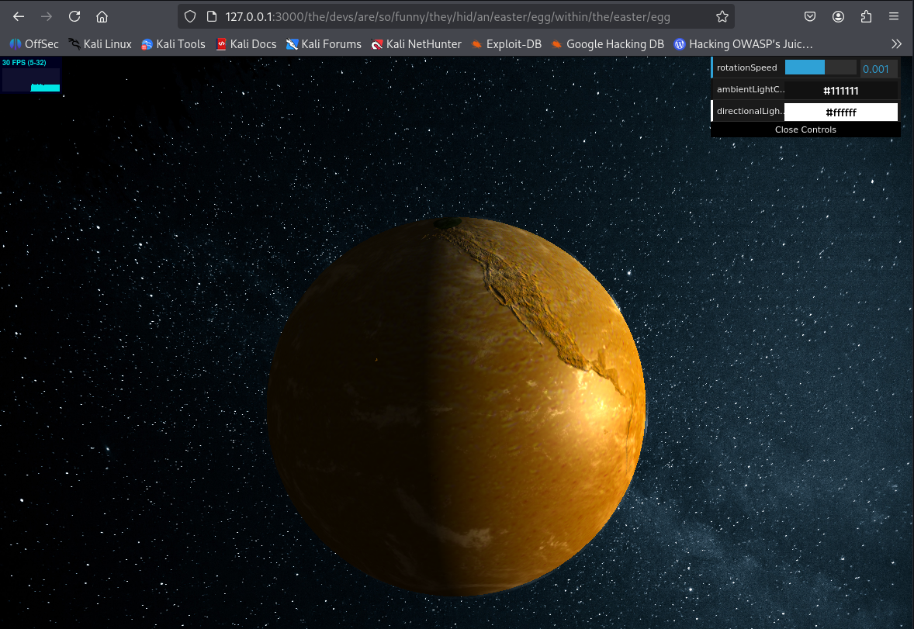

# Nested Easter Egg

Apply some advanced cryptanalysis to find the real easter egg.

**Type:** Cryptographic Issus  
**Difficulty:** 4 Stars

>[!CAUTION]  
> First you have to solve the easteregg challenge to get the easteregg-file

## Procedure

With the "Easter Egg"-challenge we got a file that points us to this challenge.

  

As we can see, in line 12 there is an encoded string. The double equal signs at the end of this string suggest that it is Base64 encoding.  
So, open up the terminal and try to decode:

```bash
echo L2d1ci9xcmlmL25lci9mYi9zaGFhbC9ndXJsL3V2cS9uYS9ybmZncmUvcnR0L2p2Z3V2YS9ndXIvcm5mZ3JlL3J0dA== | base64 --decode
```

  

The decoded string looks strange, but the forward slashes and the note “The real easter egg can be found here” suggest a URL.  
However, when we try to access this URL, only a blank page appears. 

  

So let's take a closer look.  

It is a cryptographic challenge, so it stands to reason that it is an encrypted URL. Since the forward slashes do not appear to be encrypted and it looks as if the letters of the individual words have been shifted, we can assume that it is a Caesar cipher, in which the letters are shifted by a defined number. You could now try to go through all the shifts or use an online tool that does it for you.  
And voilà, legible words appear at ROT13.



Copy and paste this complete URL-fragment at the end of the base URL will get us to the real easter egg.  

  

And the challenge is solved.  


